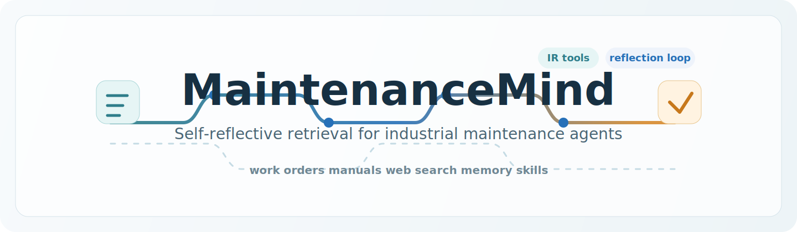

# MaintenanceMind



> MaintenanceMind is an industrial maintenance investigation agent that retrieves
> evidence from work-order history, equipment manuals, and the web before it
> answers.

Course project for LIS060 Natural Language Processing at Stockholm University.

## Project Goal

Maintenance technicians often need context from several information sources at
once: similar historical failures, documented procedures, and external updates.
MaintenanceMind demonstrates how an AI agent can use Information Retrieval (IR)
tools to gather that context before producing a diagnosis.

The prototype focuses on pharmaceutical manufacturing examples such as tablet
presses, coating pans, mixers, blister packaging machines, filling lines, and
autoclaves.

## What The Agent Does

Given a natural-language maintenance question, the agent can:

1. Search a local semantic index of historical work orders.
2. Search PDF or Markdown equipment manuals chunked into a FAISS vector index.
3. Search the public web through a web-search tool.
4. Read full work-order records after a search hit looks relevant.
5. Use Markdown skills to control search strategy and citation behavior.
6. Store durable user/site facts in a JSON memory file across sessions.

## Novel Contribution

The project adds a self-reflective retrieval step after each tool round. A
separate structured LLM call assesses:

- whether the collected evidence is sufficient,
- what context is still missing,
- which tool/query should be tried next,
- whether retrieved sources conflict.

That reflection is fed back into the next ReAct iteration. The agent therefore
does not only retrieve context; it explicitly evaluates retrieval sufficiency
before deciding whether to answer.

## Architecture

```text
User
  |
  v
CLI / Streamlit UI
  |
  v
Agent ReAct loop
  |-- Markdown skills
  |-- Persistent JSON memory
  |-- Self-reflective evidence evaluation
  |
  +--> search_work_orders -> SentenceTransformers -> FAISS work-order index
  +--> search_manuals     -> SentenceTransformers -> FAISS manual index
  +--> get_work_order     -> full work-order metadata
  +--> web_search         -> DDGS web results
```

The tool registry keeps retrieval tools extensible: new context tools can be
added as Python handlers with OpenAI-compatible function schemas.

## Repository Layout

```text
agent/       ReAct loop, LLM client, reflection, skills loading, memory
tools/       IR tools and function-calling registry
scripts/     Synthetic data generation and vector-index construction
skills/      Markdown instructions used by the agent
data/        Demo work orders, manual sources, and local index cache
tests/       Smoke and retrieval-quality checks
app.py       Streamlit UI
main.py      CLI entry point
```

## Setup

### Requirements

- Python 3.10-3.12
- An OpenAI-compatible LLM API key
- Internet access for model downloads and optional web search

Berget.AI works because it exposes an OpenAI-compatible endpoint. Other
OpenAI-compatible providers can be configured with the same environment fields.

### Install

```bash
git clone <your-github-repo-url>
cd maintenance-mind
python3.11 -m venv .venv
source .venv/bin/activate
pip install -r requirements.txt
```

### Configure

Create `.env` from `.env.example`:

```bash
cp .env.example .env
```

Set your API configuration:

```env
BERGET_API_KEY=your_key_here
BERGET_BASE_URL=https://api.berget.ai/v1
BERGET_MODEL=openai/gpt-oss-120b
```

The code uses the OpenAI Python SDK and the provider settings above to connect to
an OpenAI-compatible chat-completions API. The generic aliases
`OPENAI_API_KEY`, `OPENAI_BASE_URL`, and `OPENAI_MODEL` are also supported.

## Data And Indices

This repo includes demo synthetic work orders and fallback Markdown manuals so
the retrieval pipeline can be exercised immediately.

To regenerate synthetic data or add your own manuals:

```bash
python scripts/generate_orders.py
python scripts/generate_manuals.py
# Or put PDF/Markdown manuals under data/manuals/
python scripts/build_index.py
```

`scripts/build_index.py` stores local FAISS and pickle index caches under
`data/indices/`. Those cache files are ignored by Git and can be rebuilt.

## Run

CLI:

```bash
python main.py
```

Streamlit UI:

```bash
streamlit run app.py
```

Example maintenance prompt:

```text
Tablet press machine #3 produces tablets with weight variation exceeding +/-5%.
I already cleaned the dies. What could be wrong?
```

## Verification

Build local indices before running retrieval checks:

```bash
python scripts/build_index.py
python tests/test_retrieval_quality.py
python tests/test_tools.py
python tests/test_agent.py
```

`tests/test_agent.py` uses the configured LLM endpoint. The tool and retrieval
tests also exercise local indices and web search behavior.

## Assignment Fit

MaintenanceMind extends an agent with IR context tools rather than relying only
on the model's internal knowledge:

- local semantic search over historical work orders,
- semantic search over equipment manuals,
- public web search,
- memory files and Markdown skills inspired by agent architectures such as
  OpenClaw,
- an extensible registry for new IR tools,
- self-reflective retrieval as the project-specific creative extension.

## Limitations

- Included work orders and fallback manuals are synthetic demo data.
- Manual retrieval quality improves when real domain manuals are added.
- Web search snippets are less authoritative than internal records or equipment
  documentation.
- The agent provides investigation support, not safety authorization for
  operating or releasing industrial equipment.

## Report

The assignment report is included in [REPORT.md](REPORT.md).
